# StarBucksAnalysis
星巴克数据分析

## Iteration 2
 星巴克数据的分析工具 需求2

- 在世界地图上显示所有店铺的位置
    + 当选中某个店铺时，可以看到店铺的详细信息，如编号、名称、地址、邮编、电话等

- 将属于不同时区的店铺用不同颜色的点显示，统计每个时区中店铺的数量或密度，并可视化的展示统计结果

- 根据国家和经纬度将地图划分成不同的区域，用渐变色标识每个区域店铺数量
    
    + 举例：区域涂为深红色表示店铺数量/密度最高、正红色表示表示店铺数量/密度中等、浅红色表示表示店铺数量/密度较低、白色表示该区域没有店铺

- 统计每个国家拥有店铺的数量/密度，并可视化地给出统计结果

### 本次迭代贡献度

- 2015052281 曾旭平 25%
- 2015052282 王壁鸿 25%
- 2015052283 梁伟杰 25%
- 2015052284 林汉忠 25%

### 小组的计划

#### 用户故事、排序、相关的估计

- 用户故事及估算
    + 世界地图显示所有店铺(Show Shops in Map) -> (**1人/周, 7点**)

    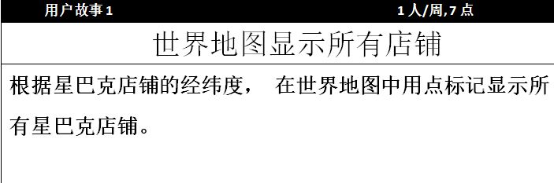

    + 显示店铺详细信息(Show Shop's Details) -> (**2人/天, 2点**)

    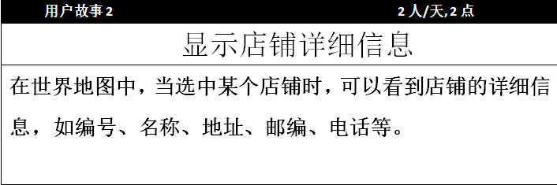

    + 不同时区店铺用不同颜色标记(Differ Shops by Timezone) -> (**1人/周, 7点**)

    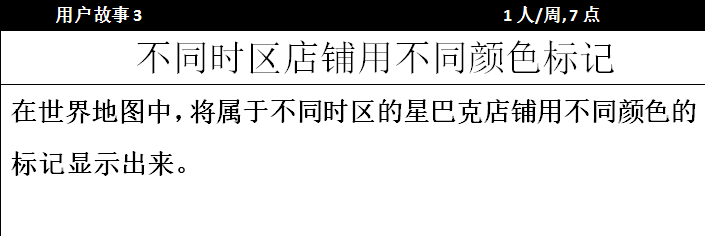

    + 统计可视化数量/密度(Statistics and Visualization) -> (**2人/天, 2点**)

    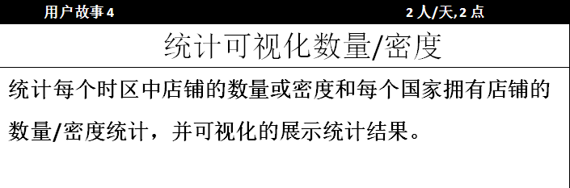

    + 渐变色标识每个区域店铺颜色(Gradient Color Identifies Each Area Shops) -> (**1人/周, 7点**)
    
    

- 排序
    + **优先级1**： 统计可视化数量/密度
    + **优先级2**： 世界地图显示所有店铺
    + **优先级3**： 显示店铺详细信息
    + **优先级4**： 不同时区店铺用不同颜色标记
    + **优先级5**： 渐变色标识每个区域店铺颜色

#### 小组的速度

- 第二次迭代所有用户故事均完成，开发速度为**25点**

#### 软件介绍

- **软件主体窗口**

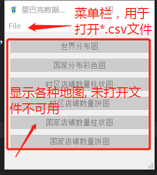

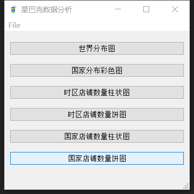

- **菜单栏打开文件**
    
    + 用于打开csv文件

    + 快捷键为Ctrl+O

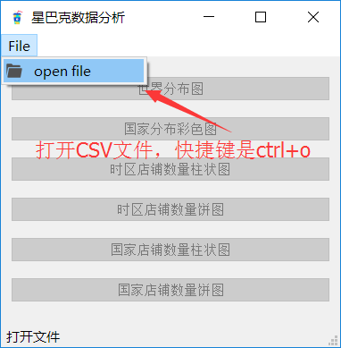

- **星巴克店铺世界分布图**
    
    + 该图显示了星巴克店铺在全球分布情况

    + 不同时区的星巴克店铺用不同的颜色标记

    + 鼠标指向某一个星巴克店铺时，会显示该店铺的详细信息，包括编号、名称、地址、邮编、电话

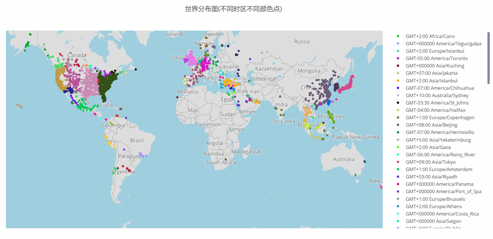

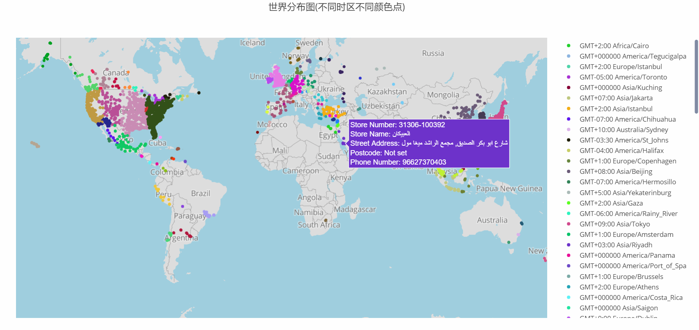

- **星巴克店铺国家区域分布密度渐变图**
    
    + 该图显示了星巴克在不同国家分布的密度情况

    + 区域颜色越红，说明该区域星巴克店铺数量越多

    + 区域颜色为纯白色时，表明该区域无星巴克店铺

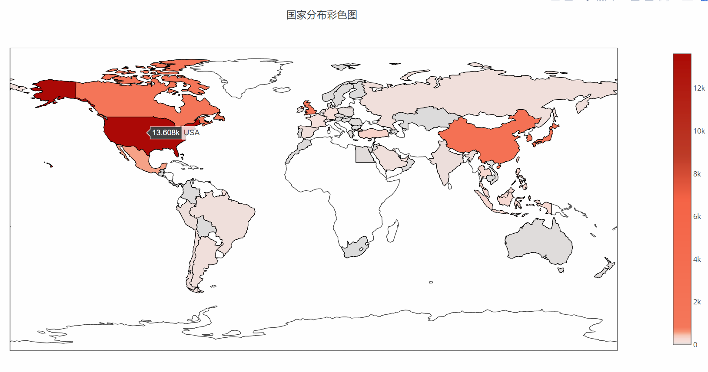

- **数据统计并可视化**

    + 在迭代1中，已经做了较为详尽的数据分析

    + 按本次需求，仅做了星巴克店铺时区分布和国家分布的柱状图和饼图

    + 由时区柱状图和饼图可知，时区GMT-05:00 America/New_York出现次数最多，且星巴克主要分布在美国时区中

    + 由国家分布柱状图和饼图可知， 星巴克店铺也是主要分布在美国

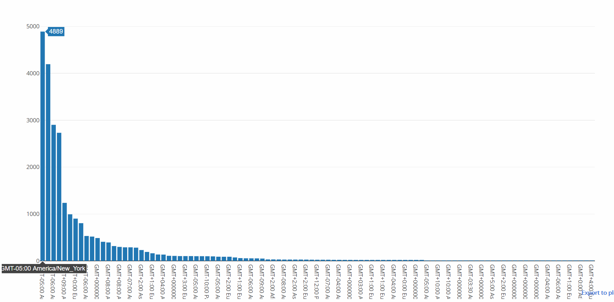

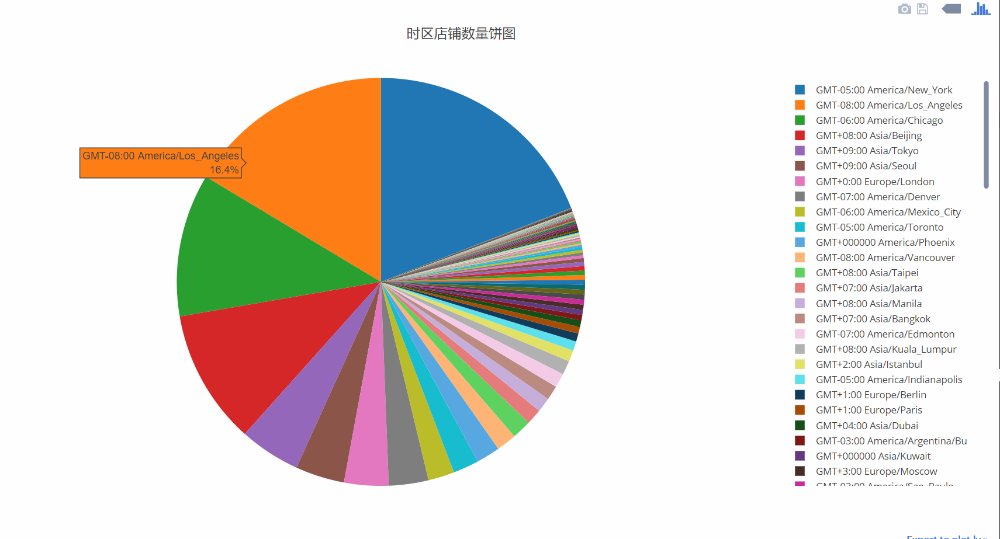

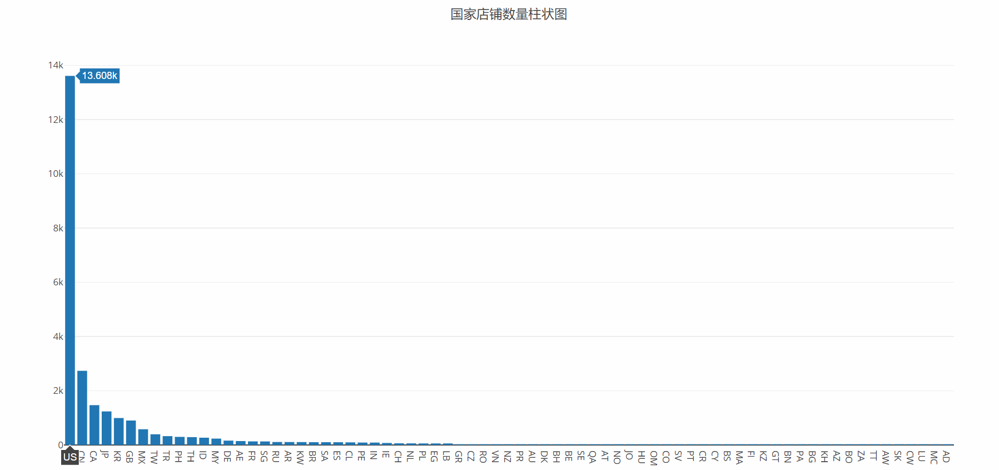

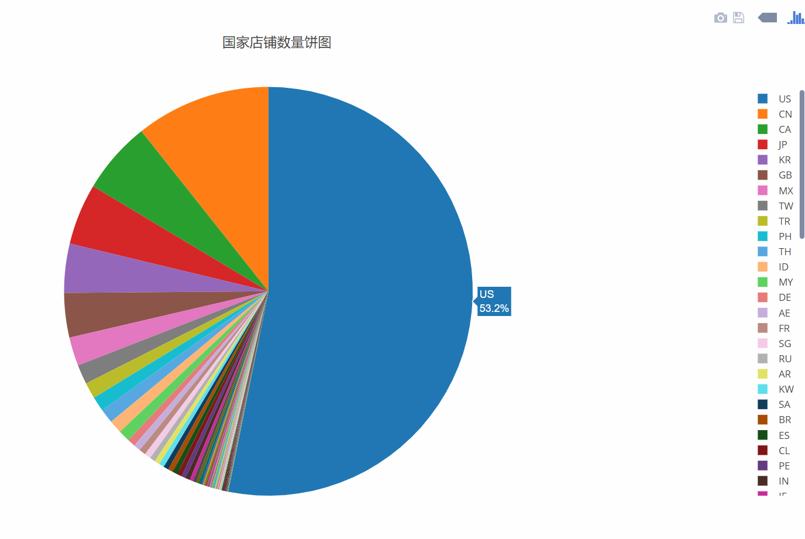

#### 开发过程总结

- Iteration1 与 Iteration2的不同

    + 迭代1过程中
        + 用户需求较为模糊，偏向于先对数据进行统计分析

    + 迭代2过程中
        + 用户提出较为详细的需求，使得开发的方向较为明确
        + 根据用户的需求，分析可知迭代1中所需要使用的工具还需要加入plotly库
        + 本次过程，大致估算出小组的开发速度

- 测试驱动的开发
    - 本次开发虽没有使用测试驱动开发，但是还是做了一定的了解

>单元测试语法
>
>进行单元测试时，使用到的Python方法如下：
>
>assert: 编写个人声明的基本方式
>
>assertEqual(a,b):检查a和b的是否等价
>
>assertNotEqual(a,b):检查a和b的是否非等价
>
>assertIn(a,b):检查是否存在b中
>
>assertNotIn(a,b): 检查是否不存在b中
>
>assertFalse(a):检查a的值是否为False
>
>assertTrue(a):检查a的值是否为Ture
>
>assertIsInstance(a,TYPE):检查a是否为“TYPE”类型
>
>assertRaises(ERROR,a,args):以参数args调用a时，检查是否会出现ERROR
>
---> 详情见 http://python.jobbole.com/81305/

---

## Iteration 1
 星巴克数据的分析工具 需求1

- 小组成员名单， 大致工作分配

- 数据集概述
    + 数据集包含哪些属性(列)
    + 表格中的值都代表什么
    + 可以从数据集中获取到哪些有用的信息

- 预期要使用（或要学习）的语言或工具

### 小组成员
- 王壁鸿
- 梁伟杰
- 曾旭平
- 林汉忠

### 预期要使用（或要学习）的语言或工具

- 预计需要学习的语言
    + python
        + pandas库, numpy库(数据分析)
        + matplotlib库(图表绘制), basemap(绘制地图)
        + PyQt5库(界面编程)

- 工具
    + pycharm(python IDE)
    + excel

### 数据集概述
总共有25600个数据, 13个属性

- 数据集中的属性(列)
    - Brand(品牌)
        + 共有25600个品牌数据
        + 共有Starbucks, Teavana, Evolution Fresh, Coffee House Holdings 四种品牌
        + Starbucks             
            * 出现 25249次
            * 分布情况: US(13311次) CN(2734次) CA(1415次) JP(1237次) KR(993次) GB(英国,901次) MX(墨西哥, 579次) ... etc.
        + Teavana               
            * 出现 348次
            * 分布在US(294次), CA(53次), PR(波多黎各,1次)三个国家
            * 三个国家均在北美洲
        + Evolution Fresh       
            * 出现 2次
            * 均在US
        + Coffee House Holdings
            * 出现 1次
            * 仅出现在US

    - Store Number(店面编号)
        + 共有25600个数据, 其中有25599个不同店面店面编号数据
        + 其中19773-160973出现了2次，后发现是两条重复的数据，其中一条数据缺少了经纬度
        + 重复的数据为: 
            + Starbucks,19773-160973,Yoido IFC Mall - 1F,Joint Venture,"23 & 23-1, Yoido-Dong, Yongdongpo-Gu, 1F, #101",Seoul,11,KR,153-023,,GMT+09:00 Asia/Seoul,126.92,37.53

    - Store Name(店面名称)
        + 共有25600个数据, 其中有25364个不同的店面名称数据
        + 出现频率最高的店面名称是"Starbucks", 共出现224次
 
    - Ownership Type(所有权类型)
        + 共有25600个数据
        + 共有Licensed, Joint Venture, Company Owned, Franchise 四种类型
        + Licensed      出现 9375次
        + Joint Venture 出现 3976次
        + Company Owned 出现 11932次
        + Franchise     出现 317次

    - Street Address(街道地址)
        + 共有25598个街道地址数据, 其中有25353个不同的街道地址数据
        + 出现频率最高的街道地址为"Circular Building #6, Guard Post 8", 共出现11次
        + 缺少街道地址的数据为:
            + Starbucks,30997-103902,베네시티점,Joint Venture,,부산,26,KR,612-020,051-742-1655,GMT+09:00 Asia/Seoul,129.15,35.16
            + Starbucks,1329-152826,광주충장로점,Joint Venture,,광주,29,KR,501-013,062-224-8344,GMT+09:00 Asia/Seoul,126.91,35.15

    - City(城市)
        + 共有25585个城市数据, 其中有5469个不同的城市数据
        + 出现频率最高的城市是"上海市", 共出现542次

    - State/Province(州/省份)
        + 共有25600个数据, 其中有338个不同的州/省份数据
        + 出现频率最高的数据是"CA"(美国加利福利亚州), 共出现2821次

    - Country(国家)
        + 共有25600个数据, 其中有73个不同的国家数据
        + 出现频率最高的数据是"US"(美国), 共出现13608次

    - Postcode(邮政编码)
        + 共有24078个数据, 其中有18887个不同的邮政编码数据
        + 出现频率最高的邮政编码是"0", 共出现101次, 邮政编码为0无意义, 是无效数据

    - Phone Number(电话号码)
        + 共有18739个数据, 其中有18559个不同的电话号码数据
        + 出现频率最高的电话号码是"773-686-6180", 共出现17次

    - Timezone(时区)
        + 共有25600个数据, 其中有101个不同的时区数据
        + 出现频率最高的时区数据是"GMT-05:00 America/New_York", 共出现4889次

    - Longitude(经度)、Latitude(纬度)
        + 共有25599个数据
        
### 数据初步分析

#### 星巴克世界分布图
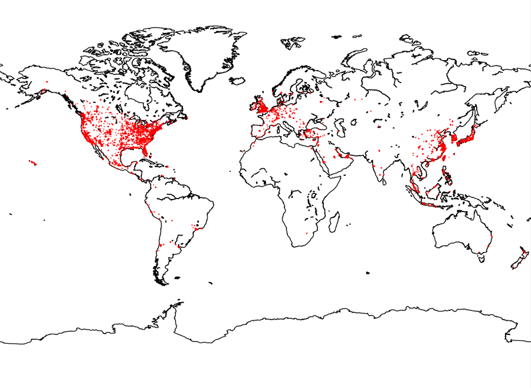

- 从星巴克世界分布图可知，星巴克店铺主要分布在北美洲，欧洲，亚洲，且主要分布在沿岸地区

---

#### 星巴克Brand(品牌)属性分析

- 共有4种品牌, Starbucks, Teavana, Evolution Fresh, Coffee House Holdings 

- 从饼图可知，星巴克主要分布在美国，加拿大，中国，日本这四大国家
- 饼图中的others是星巴克出现所在国家次数<1000的集合

---

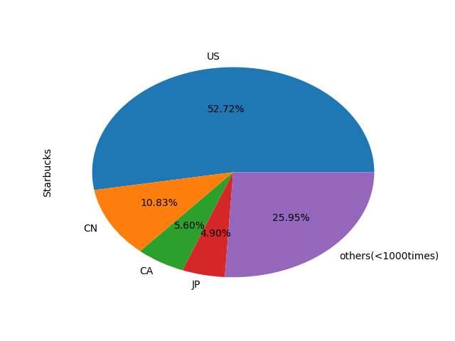

- 从饼图可知，星巴克以Starbucks为名的店面主要分布在美国，中国，加拿大，日本这四大国家
- 饼图中的others是星巴克出现所在国家次数<1000的集合
- Starbucks（数据统计）             
    * 出现 25249次
    * 分布情况: US(13311次) CN(2734次) CA(1415次) JP(1237次) KR(993次) GB(英国,901次) MX(墨西哥, 579次) ... etc.

---

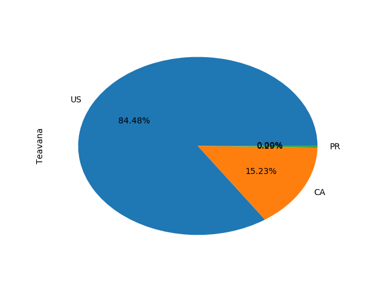

- 从饼图可知，星巴克以Teavana为名的店面分布在美国，加拿大，波多黎各三个国家，主要是在美国
- Teavana               
    * 出现 348次
    * 分布在US(294次), CA(53次), PR(波多黎各,1次)三个国家
    * 三个国家均在北美洲

---

**其他品牌: **

- Evolution Fresh       
    * 出现 2次
    * 均在US
- Coffee House Holdings 
    * 出现 1次
    * 仅出现在US

#### 星巴克街道地址属性分析

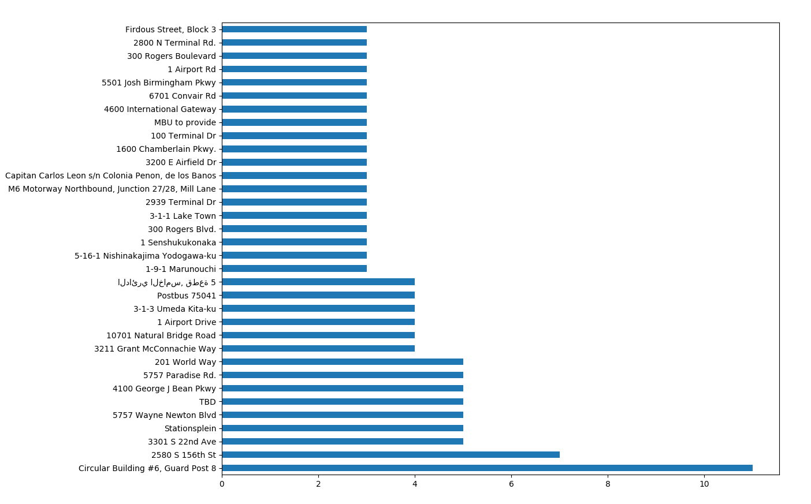

- 从柱状图可知，Circular Building #6, Guard Post 8 出现了11次
- 且有34条街道出现次数在3次以上，表明该街道可能是一个人流密集，适合经营的地段
