# StarBucksAnalysis
星巴克数据分析

## Iteration 4
星巴克数据分析工具 需求4

- 显示查询执行的进度条：
    + 如果查询执行较慢，则需要显示查询执行的进度条

- 距离range查询：
    + 用户输入经纬度和一个参数r，展示这个经纬度半径r内的所有星巴克
    + 具体要求：
        1. 直接根据经纬度计算距离即可，无需考虑建筑物、道路等因素的影响
        2. 如果用户输入的经纬度不合法，需要提示用户。
        3. 对用户的每一次输入，展示查询时延（即从查询发出，到结果返回所需要的时间）

- 关键字+距离top-k查询:
    + 用户输入经纬度，一个参数k以及一个关键词key
    + 具体要求：
        1. 关键词的相关度根据fuzzywuzzy库来实现
        2. 如果用户输入的经纬度不合法，需要提示用户。
        3. 对用户的每一次输入，展示查询时延（即从查询发出，到结果返回所需要的时间）
    
### 本次迭代贡献度

- 2015052281 曾旭平 25%
- 2015052282 王壁鸿 25%
- 2015052283 梁伟杰 25%
- 2015052284 林汉忠 25%

### 小组的计划

#### 用户故事、排序、相关的估计
- 用户故事及估算
    
    + 查询时显示进度 -> (**2人/天, 2点**)

    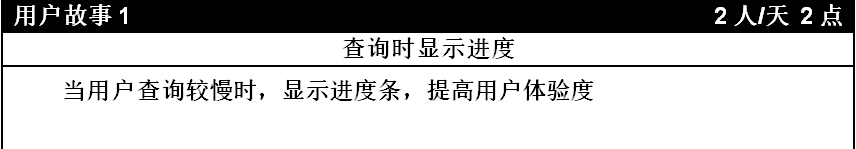

    + 在地图展示range-r店铺 -> (**1人/周, 7点**)
    
    
    
    + 设计关键词相似度算法 -> (**1人/周, 7点**)
    
    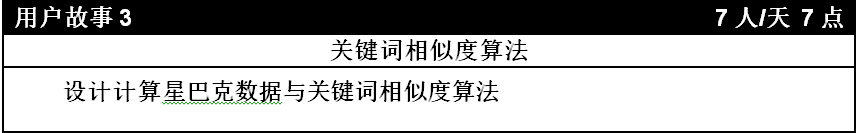
    
    + Topk+关键词搜索 -> (**1人/周, 7点**)
    
    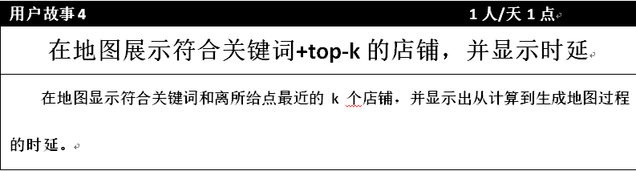
    
    + 查询时延显示 -> (**3人/天, 3点**)
    
    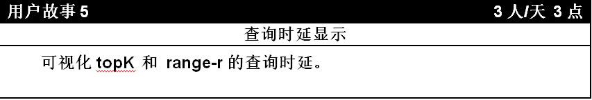

- 排序
    + **优先级1**： 查询时显示进度
    + **优先级2**： 在地图展示range-r店铺
    + **优先级3**： 设计关键词相关度算法
    + **优先级4**： Topk+关键词搜索 
    + **优先级5**： 查询时延显示

### 小组的速度

- 第四次迭代所有用户故事均完成，开发速度为 2+7+7+7+3=**26点**
- 第三次迭代所有用户故事均完成，开发速度为 1+3+7+1+7+3+2=**24点**
- 第二次迭代开发速度为 **25点**
- 小组的平均开发速度 **25点**

#### 软件介绍

- **软件主体窗口**

    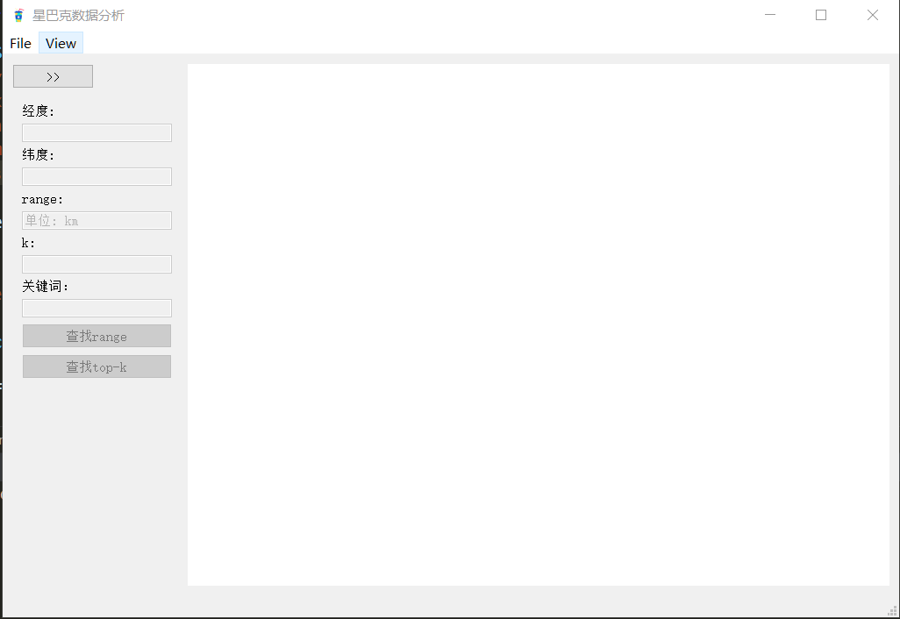

---

- **软件窗体扩展**
    
    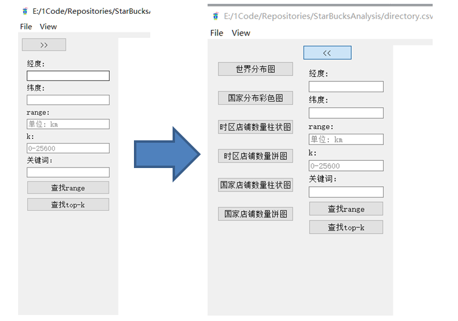

---

- **查询加载时loading**
    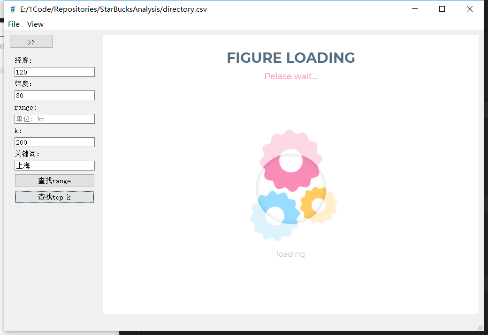

---

- **菜单栏打开文件**
    
    + 用于打开csv文件

    + 快捷键为Ctrl+O

    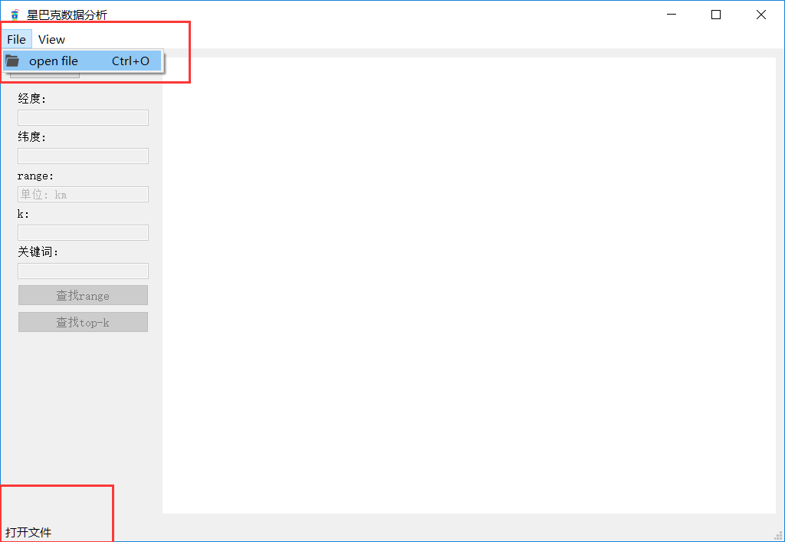

---

- **RANGE**
    
    + 用户输入经纬度，以及一个参数r

    + 显示以此经纬度为圆心的，半径为r范围的星巴克

    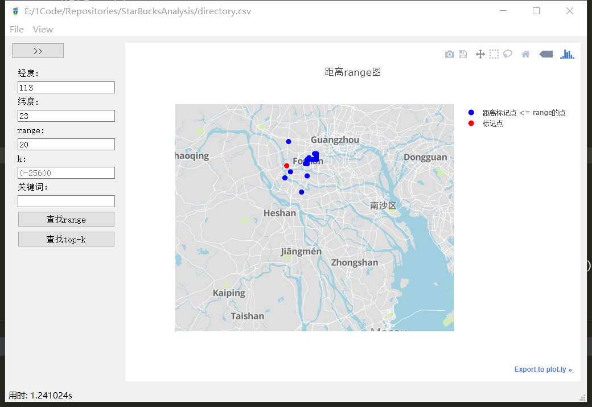

    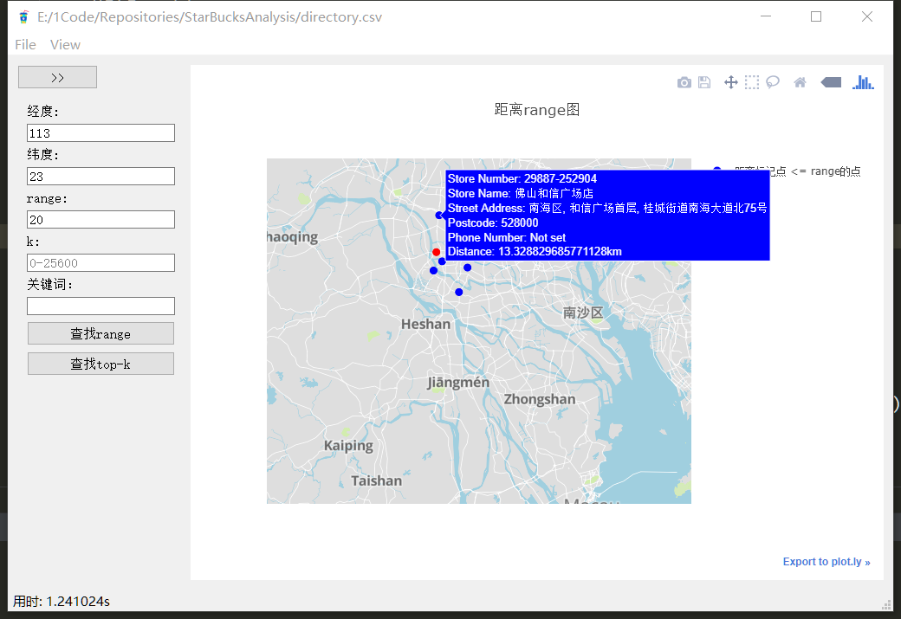

---

- **关键词+top-k**
    
    + 用户输入经纬度和一个参数k以及关键词key

    + 显示相似度最高以及最近的k个商铺

    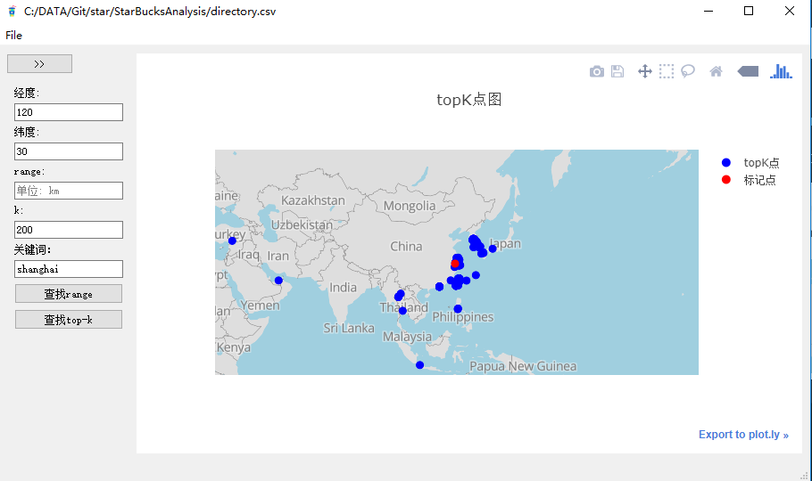

    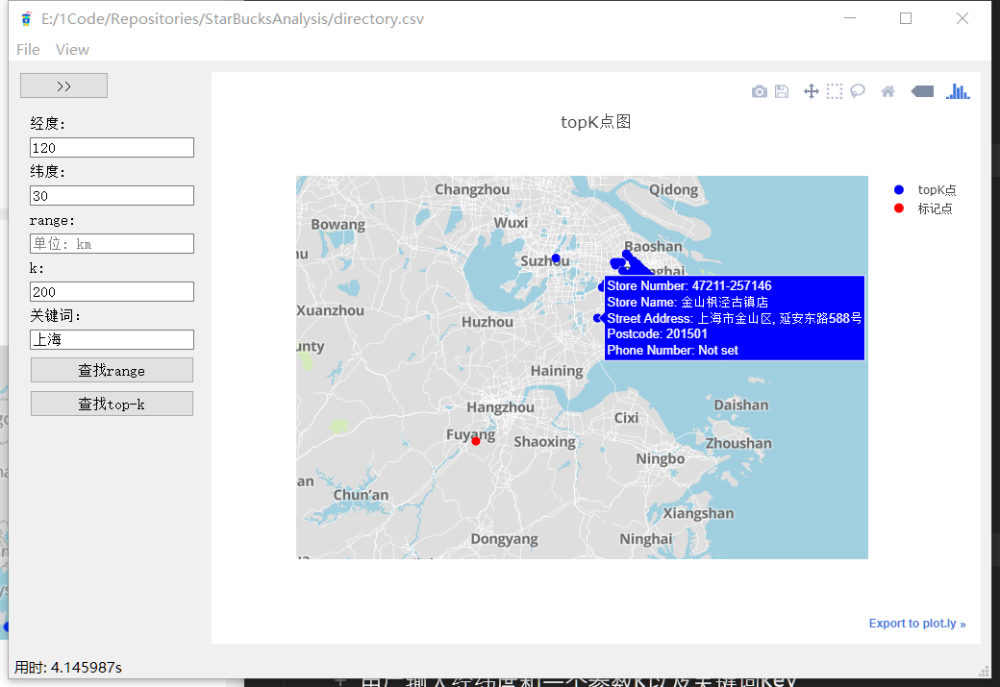

- **查询时延显示**
    
    

    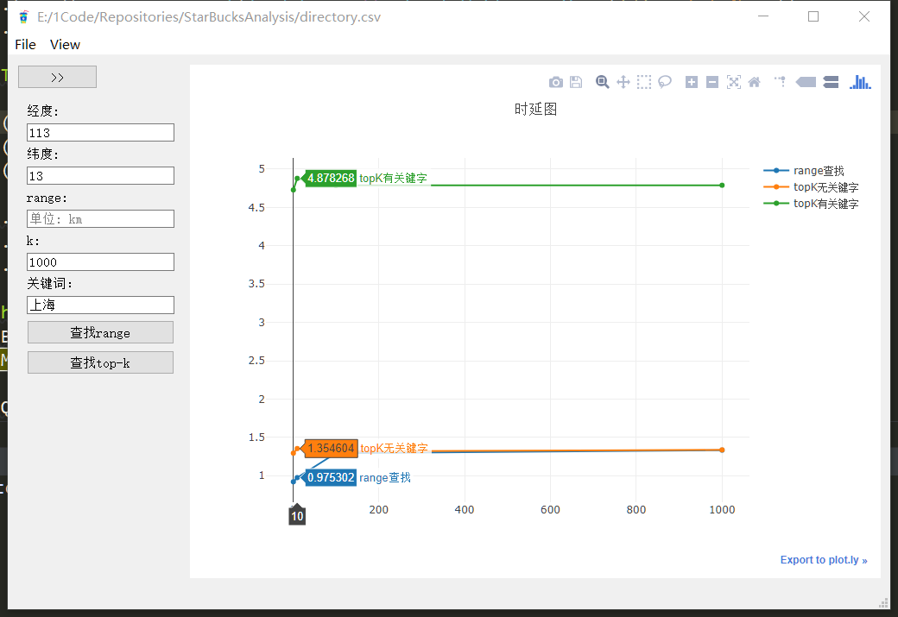

- **输入检查**
    
    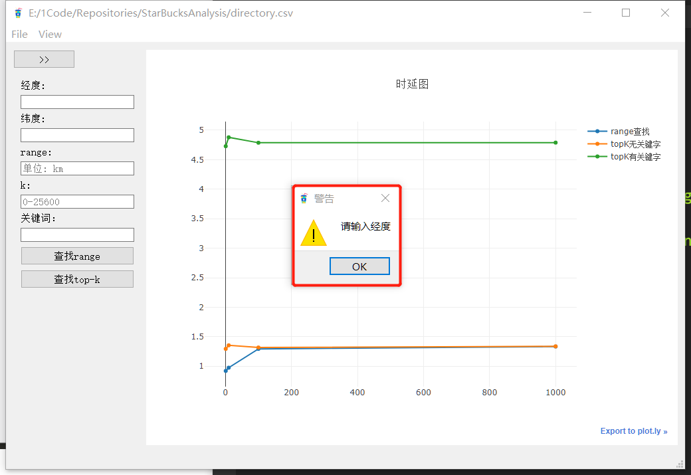
    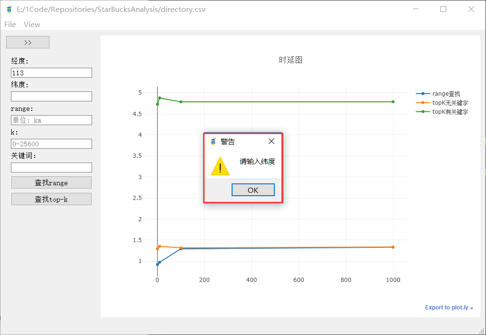
    
    
    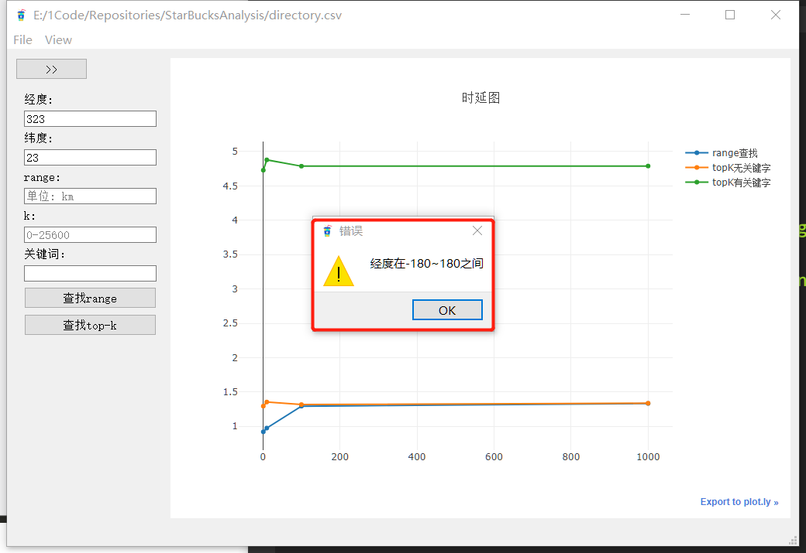
    

#### iter4 总结

##### 1.topk算法验证

- 验证pandas的nsmallest， quicksort， heapsort， mergesort
    
    + pandas 官网标注nsmallest比使用quicksort等排序快

    

+ **验证如下 **

+ 总体来看nsmallest确实比较快， quicksort有突然的高峰，表明quicksort的不稳定性
+ 且随着k值增大，耗时是有逐步变大的趋势
+ **nsmallest** 平均时延约为 **2ms**
+ **mergesort** 平均时延约为 **4ms**
+ **quicksort** 平均时延约为 **4ms**
+ **heapsort** 平均时延约为 **5ms**
+ 
    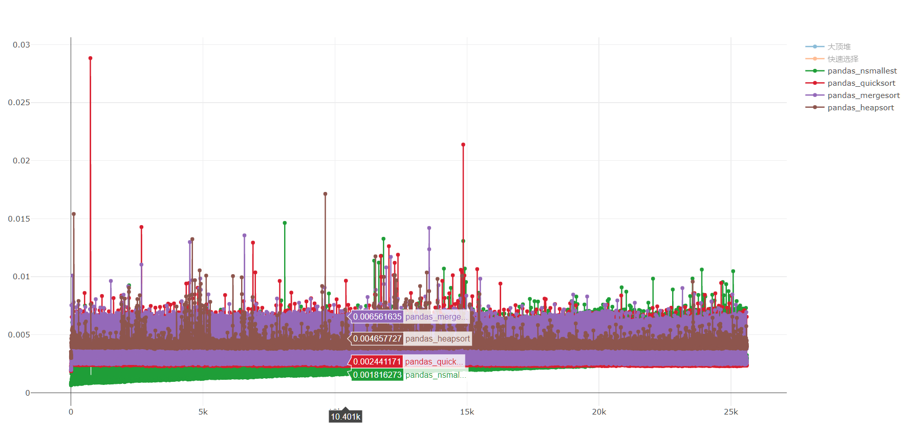

+ nsmallest 与 quciksort， 取k值属于1w-1w8来看，nsmallest确实比quicksort快
+ 原因可能是nsmallest内部有进行优化，或者使用了大顶堆算法

    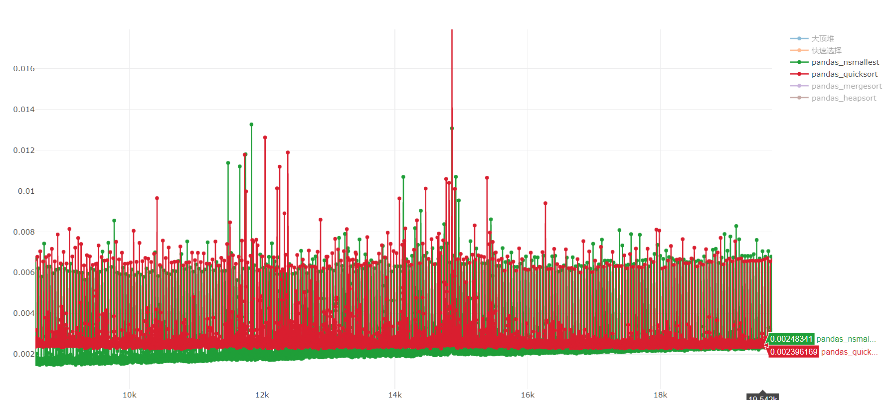

+ 由图可知nsmallest 优于 mergesort 优于 heapsort

    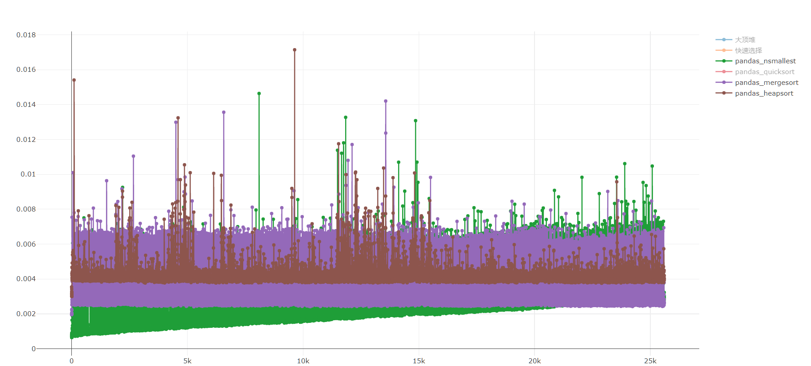
    
##### 2.geohash

+ 由于使用pandas自带的nsmallest方法效率足够快，并未使用geohash方法
+ 并且geohash仅是对经纬度哈希，虽然能减少topK距离筛选的数量，但不能用于关键字搜索

##### 3.关键词搜索

+ 本轮迭代的关键词搜索是使用**fuzzywuzzy库**的模糊匹配来实现的，并不涉及到关键词语义的分析
+ 例如**‘美国’** 与 **‘加利福利亚’** 实际是有关联度的，但fuzzywuzzy不能做到**语义分析**
+ 尝试使用**百度api**进行短文本语义分析得出相似度，但是处理**2w条数据**一次需要**35.5分钟**，最终放弃语义分析

##### 4.range-r搜索

+ 给定经纬度找出以该**经纬度为圆心半径**为**r**的所有星巴克店铺
+ 虽然能找出星巴克店铺，但在**可视化**的时候无法画出该经纬度为圆心半径为r的**圆**，导致**观感不够直接**
+ 该问题实现有**一定困难性**，因为地图生成使用的是第三方库**plotly**，该库没有提供相应的接口，小组**暂未有能力实现**

##### 5.测试驱动开发

+ 通过写ui扩展窗体样例，实现原本ui界面的扩展窗体
+ 通过编写部分样例，来考察关键字相似度算法的可靠性

