# StarBucksAnalysis
星巴克数据分析

## Iteration 5
星巴克数据分析工具 需求5

- 显示店铺信息
    + 用户点击查询到的店铺，弹出对话框显示店铺信息（包括店铺基本信息和评价信息）
    
- 对店铺进行评分
    + 用户可以对所选择的店铺进行评分，下次查询时展示该评分
    
- 计算店铺平均评分
    + 若某店铺被多次输入评分，将所有评分进行记录，并计算其平均分
    
- 特殊标明高分店铺
    + 若某店铺平均评分高于8分，则在top-k、range、top-k+关键词的查询结果里用特殊记号标明

- 完善功能+重构
    + 之前迭代中可能存在了很多遗留问题没有解决，在本轮迭代中解决它们

- 将整个项目打包成一个exe文件
    + 无需安装环境就可以执行
    
### 本次迭代贡献度

- 2015052281 曾旭平 25%
- 2015052282 王壁鸿 25%
- 2015052283 梁伟杰 25%
- 2015052284 林汉忠 25%

### 小组的计划

#### 用户故事、排序、相关的估计
- 用户故事及估算

    + 点击显示店铺信息 -> (**3人/天, 3点**)

    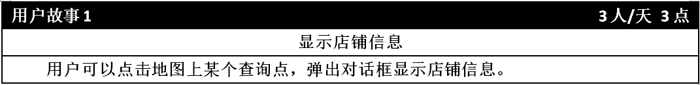
    
    + 对店铺进行评分 -> (**7人/天, 7点**)

    
    
    + 计算店铺平均分 -> (**2人/天, 2点**)

    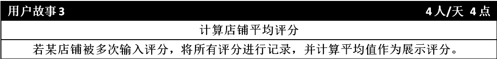
    
    + 特殊标明高分店铺 -> (**3人/天, 3点**)

    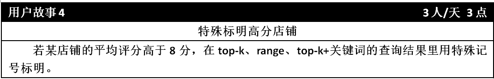

    + 完善功能+重构 -> (**7人/天, 7点**)

    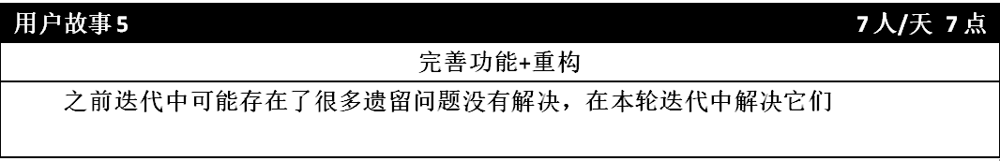

    + 将整个项目打包成一个exe文件 -> (**3人/天, 3点**)

    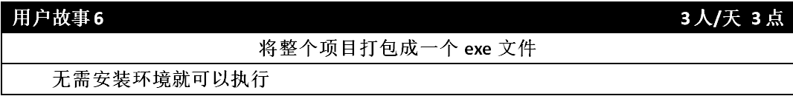
          
    
 - 排序
    + **优先级1**： 点击显示店铺信息
    + **优先级2**： 对店铺进行评分
    + **优先级3**： 计算店铺平均分
    + **优先级4**： 特殊标明高分店铺
    + **优先级5**： 完善功能+重构
    + **优先级6**： 将整个项目打包成一个exe文件
    
    
### 小组的速度

- 第四次迭代所有用户故事均完成，开发速度为 3+7+2+3+7+3=**25点**
- 第三次迭代所有用户故事均完成，开发速度为 1+3+7+1+7+3+2=**24点**
- 第二次迭代开发速度为 **25点**
- 小组的平均开发速度 **25点**

### 第五次迭代功能展示

#### 1. 点击店铺，能进行店铺的评分(即时变化)

- 点击店铺前，鼠标指向的店铺点会展示该店铺的信息
- 若该店铺没被评分过，会显示**暂无评分** 和 **评分次数0次**

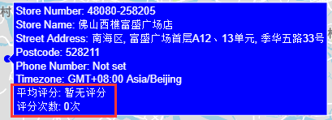

- 点击店铺点， 会显示该店铺的信息， 并有一个**下拉框**可以进行评分

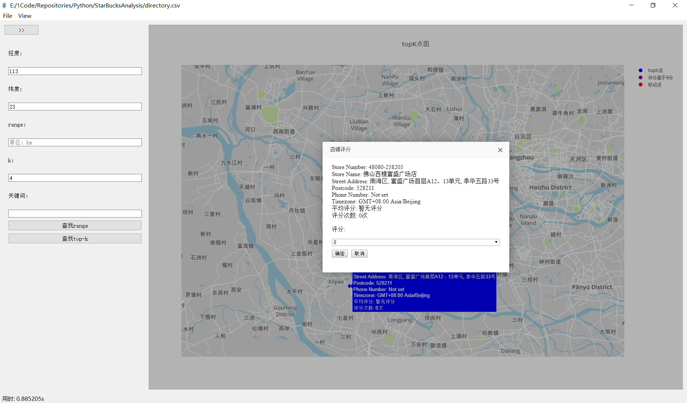

- 下拉框的取值为 **0-10分**
- 下拉框默认选中**8分**

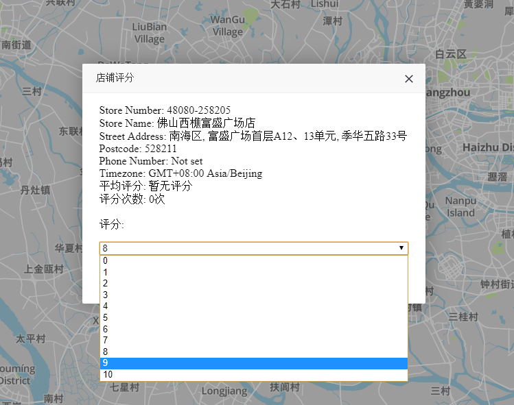

#### 2. 店铺平均分计算，高于8分用紫色点标注(即时变化)

- 多次评分， 点会显示 **平均分** 和 **评分次数**
- 评分**高于8分**， 会用紫色标注出来

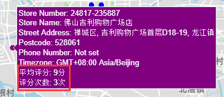

- 若有**高于8分**的店铺， **右侧**图例会显示出来
- 并可以通过**点击**图例来隐藏掉相应的点

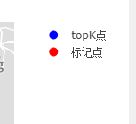

#### 3. 下次查询评分会被记录

- 程序关闭时， 会将所有本次运行的**历史评分记录到csv中**
- 下图中 `AvgScore`是平均分， `Score`是评分历史记录

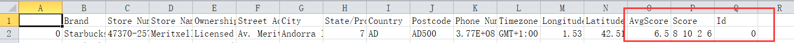

#### 4. 打包成.exe

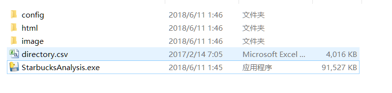

#### 5. 完善功能+重构

- 由于之前迭代的功能基本实现， 所以功能完善所做的事情较少
- 代码目录结构
    + `config`目录 -> 保存着相应的配置文件， 如jquery, plotly.js等
    + `historyIteration`目录 -> 保存着历史迭代记录
    + `html`目录 -> 保存程序生成的html
    + `image`目录 -> 保存着程序所需要用到图片资源文件
    + `README_IMG`目录 -> 保存着`README.md`的图片
    + `Test`目录 -> 保存着相应的**测试文件**
    + `calcDistance.py` -> 计算两个经纬度点间距离
    + `calcRelative.py` -> 计算关键词和数据项的相关性
    + `directory.csv` -> 数据集
    + `draw.py` -> 相关的绘图函数
    + `drawThread.py` -> 绘图函数调用的线程类(属于helper类)
    + `findRange.py` -> 找出range范围内的数据项
    + `findTopK.py` -> 找出距离最近的topK 或 与关键词相关性最大的数据项
    + `main.py` -> 主程序
    + `plot.py` -> 自己封装plotly.js的绘制地图库的接口函数
    + `pythonJsInteractObject.py` -> 实现python 与 js 交互的类
    + `ui.py` -> 界面类
    + `README.md` -> 介绍文档

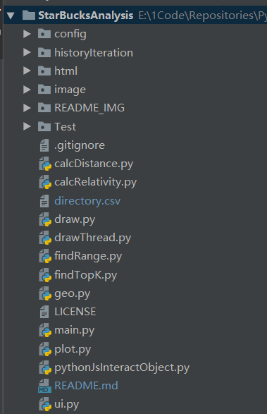

### 总结

- *本次迭代遇到**较多**的问题*

#### 店铺在地图上点的点击事件响应

- **问题1:** 店铺点击响应
    + 由于地图的绘制使用的是 第三方库 `plotly`， 该库python版**没有**相应的绑定事件的接口(因为python只能利用接口进行绘制html，交互实际上是在网页上)
    + 而通过**观察**生成的html， 实际生成的html都是有`plotly.js`来实现的
    + 也就是说python的plotly库仅仅是靠封装`plotly.js`来实现的
    + 所以方向变成了使用**js**来实现点击响应
    + 解决思路： 自己使用python**封装** plotly.js， 并封装上相应的js代码响应即可

- **问题2:** 店铺评分即时显示和计算
    + 因为评分是在网页上实现的，评分的数据是在网页上的
    + 要完成店铺评分即时显示仍然只能从**js**下手
    + 每次计算完平均分还需要重绘地图(因为地图hoverInfo的数据已经被写入到html中，需要重绘才能显示)

- **问题3:** 由于店铺评分即时显示，高于8分店铺也需要即时特殊标注
    + 本来高于8分的店铺的标注想用别的形状来标注
    + 但是官方文档却表明别的形状标注不受设置的颜色和大小影响
    + 不好控制， 所以选择**紫色**作为特殊标注的颜色
    + 当然问题不仅再此， 要实现实时改变颜色
    + 需要使用两个数组来维护
    + 一个维护着低于8分的数据， 一个维护着高于8分的数据
    + 低于8分的数据在一次评分中若平均分高于8分，需要移至高于8分的数组
    + 高于8分的数据在一次评分中若平均分低于8分，需要移至低于8分的数组

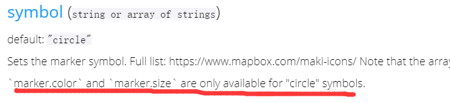

- **问题4:** python与js数据交互
    + 由于数据应回传给python
    + 然后最终由python来保存数据
    + 这就需要在python和Js之间建立一个**channel**通道来实现数据的交互

#### 打包exe程序或者源代码在不同电脑上的差异

- 部分电脑可以运行源代码以及exe
- 但是有一部分电脑**却不能运行**(配置， 代码， 操作系统一致)
- (问题出现在了自己宿舍中， 宿舍4人， 2人能运行， 2人不能运行)

#### 代码重构

- 本次迭代并没有对代码深入重构， 但由于之前良好的编码习惯， 使代码冗余度小， 灵活扩展，便于维护， 虽然并未使用过多的**设计模式**
- 后续仍需进行重构以及对之前的geoHash算法进行研究

