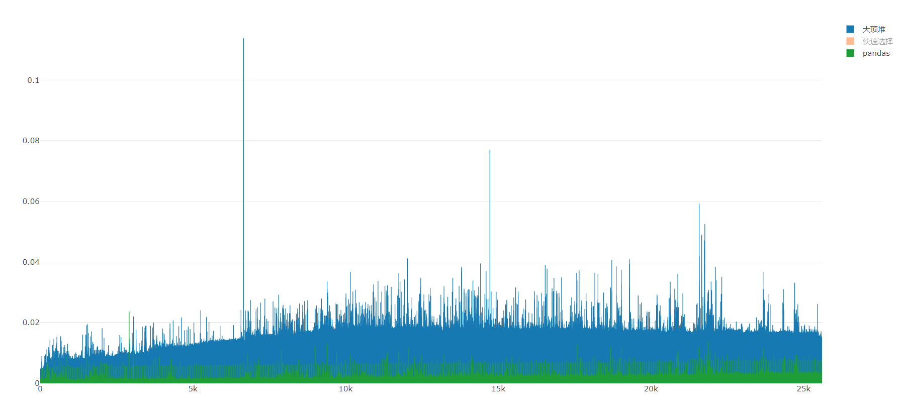
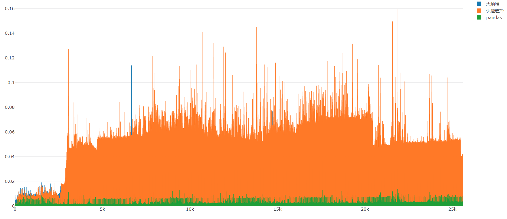

# StarBucksAnalysis
星巴克数据分析

## Iteration 3

星巴克数据分析工具 需求3

- 不同时区店铺数量渐变图：

    + 是第2轮迭代中“在将属于不同时区的店铺用不同颜色的点显示”的修改版

    + 用渐变色标识每个时区的店铺数量

    + 举例：店铺数量多的时区中的点用深红色、数量中等用正红色、数量少用浅红色

- 距离top-k查询：
    + 用户输入经纬度和一个参数k，展示距离其最近的k个星巴克

    + 具体要求：
        1. 直接根据经纬度计算距离即可，无需考虑建筑物、道路等因素的影响
        2. 如果用户输入的经纬度不合法，需要提示用户。
        3. 对用户的每一次输入，展示查询时延（即从查询发出，到结果返回所需要的时间）
        4. 用户输入经纬度，可视化展示随着k的增长查询时延的变化

### 本次迭代贡献度

- 2015052281 曾旭平 25%
- 2015052282 王壁鸿 25%
- 2015052283 梁伟杰 25%
- 2015052284 林汉忠 25%

### 小组的计划

#### 用户故事、排序、相关的估计

- 用户故事及估算
    + 统计每个时区的店铺数量 -> (**1人/天, 1点**)

    

    + 渐变色标识每个时区的店铺数量 -> (**3人/天, 3点**)

    

    + 距离top-k查询界面以及接口设置 -> (**1人/周, 7点**)

    

    + 设计经纬度计算距离算法 -> (**1人/天, 1点**)

    

    + 设计获取top-K的店铺信息算法 -> (**1人/周, 7点**)
    
    

    + 在地图展示top-K店铺，并显示时延 -> (**3人/天, 3点**)

    

    + 可视化展示随着k的增长查询时延的变化 -> (**2人/天，2点**)

    

- 排序
    + **优先级1**： 统计每个时区的店铺数量
    + **优先级2**： 渐变色标识每个时区的店铺数量
    + **优先级3**： 设计经纬度计算距离算法
    + **优先级4**： 距离top-k查询界面以及接口设置
    + **优先级5**： 设计获取top-K的店铺信息算法
    + **优先级6**： 在地图展示top-K店铺，并显示时延
    + **优先级7**： 可视化展示随着k的增长查询时延的变化

#### 小组的速度

- 第三次迭代所有用户故事均完成，开发速度为 1+3+7+1+7+3+2=**24点**
- 第二次迭代开发速度为 **25点**
- 小组的平均开发速度 **24.5点**

#### 软件介绍

- **软件主体窗口**


---

- **菜单栏打开文件**
    
    + 用于打开csv文件

    + 快捷键为Ctrl+O


---

- **星巴克时区店铺数量渐变色世界分布图**
    
    + 该图显示了星巴克店铺在全球**不同时区的数量**渐变分布

    + 时区中星巴克店铺**数量越多**，点的颜色**越深**；店铺数量**越少**，点的颜色**越浅**

    + 鼠标指向某一个星巴克店铺时，会显示该店铺的详细信息，包括编号、名称、地址、邮编、电话


---

- **星巴克店铺国家区域分布密度渐变图**
    
    + 该图显示了星巴克在不同国家分布的密度情况

    + 区域颜色越红，说明该区域星巴克店铺数量越多

    + 区域颜色为纯白色时，表明该区域无星巴克店铺


---

- **用户输入经纬度和一个参数k，展示距离其最近的k个星巴克**

    + 用户输入一个点的**经纬度**，以及参数**k**

    + 地图显示距离该点最近的**k个星巴克**


---

- **数据统计并可视化**

    + 在迭代1中，已经做了较为详尽的数据分析

    + 按本次需求，仅做了星巴克店铺时区分布和国家分布的柱状图和饼图

    + 由时区柱状图和饼图可知，时区GMT-05:00 America/New_York出现次数最多，且星巴克主要分布在美国时区中

    + 由国家分布柱状图和饼图可知， 星巴克店铺也是主要分布在美国


#### 开发过程总结

##### 关于时区问题的探讨
- 上网搜索了下GMT与UTC的区别
- 发现GMT其实与UTC是几乎是同一种概念，只是GMT是基于地球的自转和公转来计算时间，UTC是基于原子钟来计算时间的
- 而且我们数据中的GMT数据只是details数据，可以去掉


- 但是对数据进行清洗去除后缀后，发现如下情况


- 发现数据里面相同时区却是不同的字符串来表示，同时还存在着时区GMT+5:30等数据
- 所以我们放弃了去掉GMT数据后缀来划分时区，转向用经纬度换算时区的方式，绘制出如下图

- 与不去除后缀的时区渐变图相差不大， 但**保留后缀的时区渐变图**带有**国家信息**，分布更加**详细**，所以选择使用带有后缀的时区进行绘图

---

##### 对top-k算法的分析
***注: 可能因计算机环境不同，耗时不同***

- 快速选择算法 平均时间复杂度 O(n), 最坏情况为O(n^2)

- 大顶堆求前k小值 时间复杂度 O(nlogk)

- pandas自带.nsmallest()函数

- 注： 还可使用geohash算法，本次迭代没有使用






- 由图可知
    + 一次遍历计算一个点与两万个点间距离的时间耗时大约是**1s**

    + 大顶堆的时间大部分在将近**20ms**处， 快速选择大部分在将近**50ms**处， pandas自带.nsmallest()函数时间在**1ms-5ms**左右

    + 快速选择最初在**k值较小**时，用时**比较少**，而且从图中可以看到有较多的**高峰**出现，显然该选择确实是个**不稳定**的算法

    + 大顶堆的时间**比较稳定**，用时相对来说比较少

    + pandas自带的函数**用时少**，且也很**稳定**

    + 因此我们topK的获取算法使用 pandas自带.nsmallest()

- 测试代码如下: 
```python
# -*- coding: utf-8 -*-
# __Author__: Sdite
# __Email__ : a122691411@gmail.com

import time
import heapq
import pandas as pd
from math import radians, atan, tan, sin, cos, acos

import plotly.offline as py
from plotly.graph_objs import *


ra = 6378.140  # 赤道半径 (km)
rb = 6356.755  # 极半径 (km)
flatten = (ra - rb) / ra  # 地球扁率
def calcDistance(lon_a, lat_a, lon_b, lat_b):
    rad_lat_A = radians(lat_a)
    rad_lng_A = radians(lon_a)
    rad_lat_B = radians(lat_b)
    rad_lng_B = radians(lon_b)
    pA = atan(rb / ra * tan(rad_lat_A))
    pB = atan(rb / ra * tan(rad_lat_B))
    xx = acos(sin(pA) * sin(pB) + cos(pA) * cos(pB) * cos(rad_lng_A - rad_lng_B))
    c1 = (sin(xx) - xx) * (sin(pA) + sin(pB)) ** 2 / cos(xx / 2) ** 2
    c2 = (sin(xx) + xx) * (sin(pA) - sin(pB)) ** 2 / sin(xx / 2) ** 2
    dr = flatten / 8 * (c1 - c2)
    distance = ra * (xx + dr)
    return distance

# 大顶堆求前k小
def topKHeap(A, k):
    res = []
    for elem in A:
        elem = -elem
        if len(res) < k:
            heapq.heappush(res, elem)
        else:
            topkSmall = res[0]
            if elem > topkSmall:
                heapq.heapreplace(res, elem)

    return list(map(lambda x: -x, res))

# 非递归实现
def qSelect(A, k):
    if len(A) < k:
        return A

    s = []
    res = []
    s.append(A)

    while s:
        B = s.pop()
        if not B:
            break
        pivot = B[0]
        left = [x for x in B[1:] if x < pivot] + [pivot]
        lLen = len(left)
        if lLen == k:
            res += left
        elif lLen > k:
            s.append(left)
        else:
            res += left
            k -= lLen
            right = [x for x in B[1:] if x >= pivot]
            s.append(right)

    return res

if __name__ == '__main__':
    csv_file = pd.read_csv("directory.csv")

    start = time.clock()
    distance = csv_file.apply(
        lambda x:calcDistance(0, 0, x.Longitude, x.Latitude),
                              axis=1)
    end = time.clock()

    print('遍历计算点间距离时间: %fs' % (end - start))

    useTime = dict()
    useTime['heap'] = []
    useTime['qSelect'] = []
    useTime['pandas'] = []

    for k in range(1, 25601):
        start = time.clock()
        topKHeap(distance, k)
        end = time.clock()
        h = end - start
        useTime['heap'].append(h)


        start = time.clock()
        qSelect(list(distance), k)
        end = time.clock()
        q = end - start
        useTime['qSelect'].append(q)


        start = time.clock()
        distance.nsmallest(k)
        end = time.clock()
        n = end - start
        useTime['pandas'].append(n)

        print("k: %d 大顶堆: %.15fs  快速选择: %.15fs  pandas: %.15fs" % (k, h, q, n))

    import pickle
    with open('config/tmp.pickle', 'wb') as f:
        pickle.dump(useTime, f)

    # with open('config/tmp.pickle', 'rb') as f:
    #     useTime = pickle.load(f)
    #
    # trace1 = Bar(
    #     y=useTime['heap'],
    #     x=list(range(1, 25601)),
    #     name='大顶堆'
    # )
    # trace2 = Bar(
    #     y=useTime['qSelect'],
    #     x=list(range(1, 25601)),
    #     name='快速选择'
    # )
    # trace3 = Bar(
    #     y=useTime['pandas'],
    #     x=list(range(1, 25601)),
    #     name='pandas'
    # )
    # data = [trace1, trace2, trace3]
    # layout = Layout(
    #     barmode='group'
    # )
    # fig = Figure(data=data, layout=layout)
    # py.plot(fig, filename='html/时间比较.html')

```

##### 测试驱动相关

- 编写findTopK函数的测试:


---

## Iteration 2
星巴克数据的分析工具 需求2

- 在世界地图上显示所有店铺的位置
    + 当选中某个店铺时，可以看到店铺的详细信息，如编号、名称、地址、邮编、电话等

- 将属于不同时区的店铺用不同颜色的点显示，统计每个时区中店铺的数量或密度，并可视化的展示统计结果

- 根据国家和经纬度将地图划分成不同的区域，用渐变色标识每个区域店铺数量
    
    + 举例：区域涂为深红色表示店铺数量/密度最高、正红色表示表示店铺数量/密度中等、浅红色表示表示店铺数量/密度较低、白色表示该区域没有店铺

- 统计每个国家拥有店铺的数量/密度，并可视化地给出统计结果

### 本次迭代贡献度

- 2015052281 曾旭平 25%
- 2015052282 王壁鸿 25%
- 2015052283 梁伟杰 25%
- 2015052284 林汉忠 25%

### 小组的计划

#### 用户故事、排序、相关的估计

- 用户故事及估算
    + 世界地图显示所有店铺(Show Shops in Map) -> (**1人/周, 7点**)

    

    + 显示店铺详细信息(Show Shop's Details) -> (**2人/天, 2点**)

    

    + 不同时区店铺用不同颜色标记(Differ Shops by Timezone) -> (**1人/周, 7点**)

    

    + 统计可视化数量/密度(Statistics and Visualization) -> (**2人/天, 2点**)

    

    + 渐变色标识每个区域店铺颜色(Gradient Color Identifies Each Area Shops) -> (**1人/周, 7点**)
    
    

- 排序
    + **优先级1**： 统计可视化数量/密度
    + **优先级2**： 世界地图显示所有店铺
    + **优先级3**： 显示店铺详细信息
    + **优先级4**： 不同时区店铺用不同颜色标记
    + **优先级5**： 渐变色标识每个区域店铺颜色

#### 小组的速度

- 第二次迭代所有用户故事均完成，开发速度为**25点**


#### 软件介绍

- **软件主体窗口**


- **菜单栏打开文件**
    
    + 用于打开csv文件

    + 快捷键为Ctrl+O


- **星巴克店铺世界分布图**
    
    + 该图显示了星巴克店铺在全球分布情况

    + 不同时区的星巴克店铺用不同的颜色标记

    + 鼠标指向某一个星巴克店铺时，会显示该店铺的详细信息，包括编号、名称、地址、邮编、电话


- **星巴克店铺国家区域分布密度渐变图**
    
    + 该图显示了星巴克在不同国家分布的密度情况

    + 区域颜色越红，说明该区域星巴克店铺数量越多

    + 区域颜色为纯白色时，表明该区域无星巴克店铺


- **数据统计并可视化**

    + 在迭代1中，已经做了较为详尽的数据分析

    + 按本次需求，仅做了星巴克店铺时区分布和国家分布的柱状图和饼图

    + 由时区柱状图和饼图可知，时区GMT-05:00 America/New_York出现次数最多，且星巴克主要分布在美国时区中

    + 由国家分布柱状图和饼图可知， 星巴克店铺也是主要分布在美国


#### 开发过程总结

- Iteration1 与 Iteration2的不同

    + 迭代1过程中
        + 用户需求较为模糊，偏向于先对数据进行统计分析

    + 迭代2过程中
        + 用户提出较为详细的需求，使得开发的方向较为明确
        + 根据用户的需求，分析可知迭代1中所需要使用的工具还需要加入plotly库
        + 本次过程，大致估算出小组的开发速度

- 测试驱动的开发
    - 本次开发虽没有使用测试驱动开发，但是还是做了一定的了解

>单元测试语法
>
>进行单元测试时，使用到的Python方法如下：
>
>assert: 编写个人声明的基本方式
>
>assertEqual(a,b):检查a和b的是否等价
>
>assertNotEqual(a,b):检查a和b的是否非等价
>
>assertIn(a,b):检查是否存在b中
>
>assertNotIn(a,b): 检查是否不存在b中
>
>assertFalse(a):检查a的值是否为False
>
>assertTrue(a):检查a的值是否为Ture
>
>assertIsInstance(a,TYPE):检查a是否为“TYPE”类型
>
>assertRaises(ERROR,a,args):以参数args调用a时，检查是否会出现ERROR
>
---> 详情见 http://python.jobbole.com/81305/


---

## Iteration 1
 星巴克数据的分析工具 需求1

- 小组成员名单， 大致工作分配

- 数据集概述
    + 数据集包含哪些属性(列)
    + 表格中的值都代表什么
    + 可以从数据集中获取到哪些有用的信息

- 预期要使用（或要学习）的语言或工具

### 小组成员
- 王壁鸿
- 梁伟杰
- 曾旭平
- 林汉忠


### 预期要使用（或要学习）的语言或工具

- 预计需要学习的语言
    + python
        + pandas库, numpy库(数据分析)
        + matplotlib库(图表绘制), basemap(绘制地图)
        + PyQt5库(界面编程)

- 工具
    + pycharm(python IDE)
    + excel


### 数据集概述
总共有25600个数据, 13个属性

- 数据集中的属性(列)
    - Brand(品牌)
        + 共有25600个品牌数据
        + 共有Starbucks, Teavana, Evolution Fresh, Coffee House Holdings 四种品牌
        + Starbucks             
            * 出现 25249次
            * 分布情况: US(13311次) CN(2734次) CA(1415次) JP(1237次) KR(993次) GB(英国,901次) MX(墨西哥, 579次) ... etc.
        + Teavana               
            * 出现 348次
            * 分布在US(294次), CA(53次), PR(波多黎各,1次)三个国家
            * 三个国家均在北美洲
        + Evolution Fresh       
            * 出现 2次
            * 均在US
        + Coffee House Holdings
            * 出现 1次
            * 仅出现在US

    - Store Number(店面编号)
        + 共有25600个数据, 其中有25599个不同店面店面编号数据
        + 其中19773-160973出现了2次，后发现是两条重复的数据，其中一条数据缺少了经纬度
        + 重复的数据为: 
            + Starbucks,19773-160973,Yoido IFC Mall - 1F,Joint Venture,"23 & 23-1, Yoido-Dong, Yongdongpo-Gu, 1F, #101",Seoul,11,KR,153-023,,GMT+09:00 Asia/Seoul,126.92,37.53

    - Store Name(店面名称)
        + 共有25600个数据, 其中有25364个不同的店面名称数据
        + 出现频率最高的店面名称是"Starbucks", 共出现224次
 
    - Ownership Type(所有权类型)
        + 共有25600个数据
        + 共有Licensed, Joint Venture, Company Owned, Franchise 四种类型
        + Licensed      出现 9375次
        + Joint Venture 出现 3976次
        + Company Owned 出现 11932次
        + Franchise     出现 317次

    - Street Address(街道地址)
        + 共有25598个街道地址数据, 其中有25353个不同的街道地址数据
        + 出现频率最高的街道地址为"Circular Building #6, Guard Post 8", 共出现11次
        + 缺少街道地址的数据为:
            + Starbucks,30997-103902,베네시티점,Joint Venture,,부산,26,KR,612-020,051-742-1655,GMT+09:00 Asia/Seoul,129.15,35.16
            + Starbucks,1329-152826,광주충장로점,Joint Venture,,광주,29,KR,501-013,062-224-8344,GMT+09:00 Asia/Seoul,126.91,35.15

    - City(城市)
        + 共有25585个城市数据, 其中有5469个不同的城市数据
        + 出现频率最高的城市是"上海市", 共出现542次

    - State/Province(州/省份)
        + 共有25600个数据, 其中有338个不同的州/省份数据
        + 出现频率最高的数据是"CA"(美国加利福利亚州), 共出现2821次

    - Country(国家)
        + 共有25600个数据, 其中有73个不同的国家数据
        + 出现频率最高的数据是"US"(美国), 共出现13608次

    - Postcode(邮政编码)
        + 共有24078个数据, 其中有18887个不同的邮政编码数据
        + 出现频率最高的邮政编码是"0", 共出现101次, 邮政编码为0无意义, 是无效数据

    - Phone Number(电话号码)
        + 共有18739个数据, 其中有18559个不同的电话号码数据
        + 出现频率最高的电话号码是"773-686-6180", 共出现17次

    - Timezone(时区)
        + 共有25600个数据, 其中有101个不同的时区数据
        + 出现频率最高的时区数据是"GMT-05:00 America/New_York", 共出现4889次

    - Longitude(经度)、Latitude(纬度)
        + 共有25599个数据
        
### 数据初步分析

#### 星巴克世界分布图


- 从星巴克世界分布图可知，星巴克店铺主要分布在北美洲，欧洲，亚洲，且主要分布在沿岸地区

---

#### 星巴克Brand(品牌)属性分析

- 共有4种品牌, Starbucks, Teavana, Evolution Fresh, Coffee House Holdings 


- 从饼图可知，星巴克主要分布在美国，加拿大，中国，日本这四大国家
- 饼图中的others是星巴克出现所在国家次数<1000的集合

---


- 从饼图可知，星巴克以Starbucks为名的店面主要分布在美国，中国，加拿大，日本这四大国家
- 饼图中的others是星巴克出现所在国家次数<1000的集合
- Starbucks（数据统计）             
    * 出现 25249次
    * 分布情况: US(13311次) CN(2734次) CA(1415次) JP(1237次) KR(993次) GB(英国,901次) MX(墨西哥, 579次) ... etc.

---


- 从饼图可知，星巴克以Teavana为名的店面分布在美国，加拿大，波多黎各三个国家，主要是在美国
- Teavana               
    * 出现 348次
    * 分布在US(294次), CA(53次), PR(波多黎各,1次)三个国家
    * 三个国家均在北美洲

---

**其他品牌: **

- Evolution Fresh       
    * 出现 2次
    * 均在US
- Coffee House Holdings 
    * 出现 1次
    * 仅出现在US

#### 星巴克街道地址属性分析


- 从柱状图可知，Circular Building #6, Guard Post 8 出现了11次
- 且有34条街道出现次数在3次以上，表明该街道可能是一个人流密集，适合经营的地段
